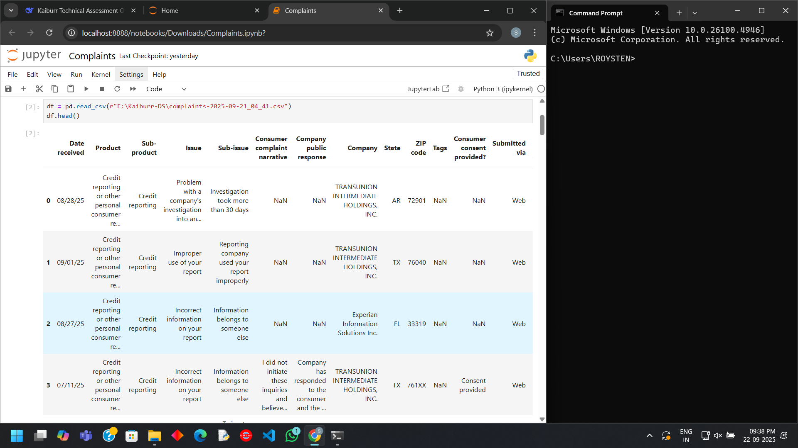

# Consumer-complaint-classification-system-Task_5
# Project Overview
This project implements a machine learning system to automatically classify consumer financial complaints into four regulatory categories. The system processes natural language complaints and accurately categorizes them using NLP techniques and optimized classification algorithms.
# Business Problem
Financial institutions receive thousands of consumer complaints daily. Automating the classification process ensures:
- Faster response times
- Consistent categorization
- Efficient resource allocation
- Regulatory compliance
# Dataset Analysis
- Source: Consumer Financial Protection Bureau (CFPB)
- Dataset size: 15 Lakhs or 1.5 million complaints
- Time period: 3 month data
- Final cleaned data: 1,17,590 complaints with complete narratives

