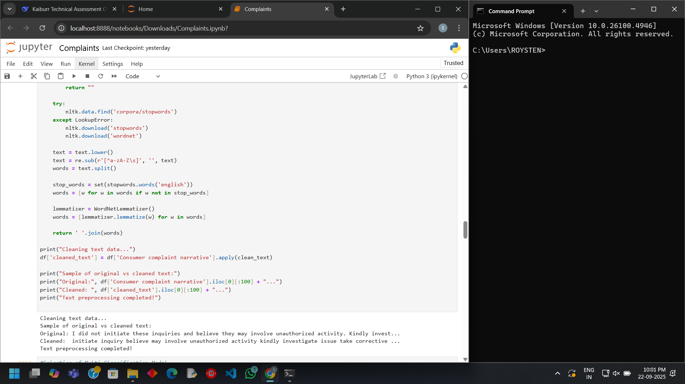
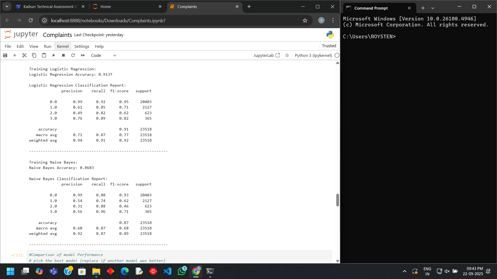
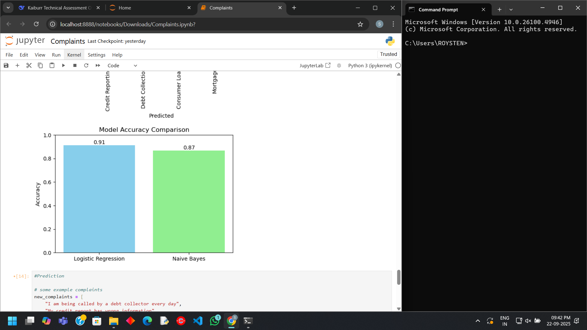
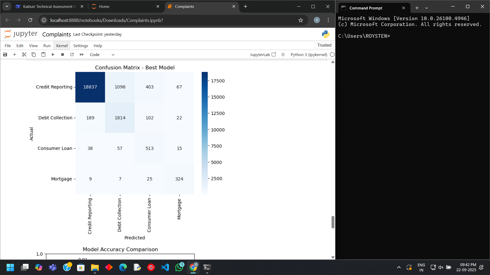

# Consumer-complaint-classification-system-Task_5
# Project Overview
This project implements a machine learning system to automatically classify consumer financial complaints into four regulatory categories. The system processes natural language complaints and accurately categorizes them using NLP techniques and optimized classification algorithms.
# Business Problem
Financial institutions receive thousands of consumer complaints daily. Automating the classification process ensures:
- Faster response times
- Consistent categorization
- Efficient resource allocation
- Regulatory compliance
# Dataset Analysis
- Source: Consumer Financial Protection Bureau (CFPB)
- Dataset size: 15 Lakhs or 1.5 million complaints
- Time period: 3 month data
- Final cleaned data: 1,17,590 complaints with complete narratives
### Initial data shape:

### Dataset structure:

# Class distribution challenge:
### Visualization shows severe class imbalance across categories:

### Percentage for class imbalance across categories:

- To overcome this problem Synthetic Minority Oversampling Technique (SMOTE) is used
### SMOTE is applied to Training set:

# Technical Implementation
### Text pre processing:

### Feature Engineering
- Text Cleaning: Comprehensive NLP preprocessing
- TF-IDF Vectorization: 5,000 most important features
- Stratified Sampling: Maintained class proportions in train/test splits
### Model Selection
Model Selection Strategy
These selected two models are specifically suited for text classification:
Logistic Regression - Optimal for high-dimensional text data
Multinomial Naive Bayes - Classic baseline for text classification
# Model Performance
### Detailed Evaluation:

### Accuracy comparison

### Confusion matrix

# Prediction system
The system successfully classifies real world consumer complaints
### Prediction system examples

